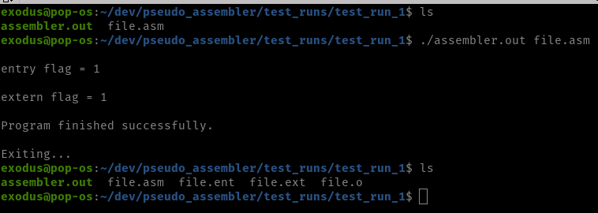

# Pseudo Assembler [![License][license-badge]][license]

[license-badge]: https://img.shields.io/github/license/ajeetdsouza/zoxide?color=lightgray&style=flat-square
[license]: ./LICENSE

[[Source Code]][src]

[src]:          ./source

A multi-pass pseudo assembler for a predefined, made-up, Assembly-type language.
Developed in C.

<p align="center">

</p>

## Table of Contents
- [Compilation](#Compilation)
- [Usage](#Usage)

## Compilation

This project includes a makefile for easy compilation on linux distributions:

* make:

```sh
    $ make
```

<p align="center">
  
</p>

<details><summary>Additional rules</summary>

</br>

* compile:

```sh
    $ make compile
```

<p align="center">
  
</p>

* clean:

```sh
    $ make clean
```

<p align="center">
  
</p>

* rm:

```sh
    $ make rm
```

<p align="center">
  
</p>

* full_clean:

```sh
    $ make full_clean
```

<p align="center">
  
</p>

</details>

## Usage

The input should consist of one or more assembly files ('.asm' files).

```sh
    $ ./assembler.out [name_of_file].asm
```

The output should consist of one to three files:</br>
- The machine code, in the form of an object file ('.o')</br>
- A file with information about external symbols ('.ext'); won't be created if the .extern command wasn't in use</br>
- A file with information about entry symbols ('.ent'); won't be created if the .entry command wasn't in use</br>

<p align="center">
  
</p>

