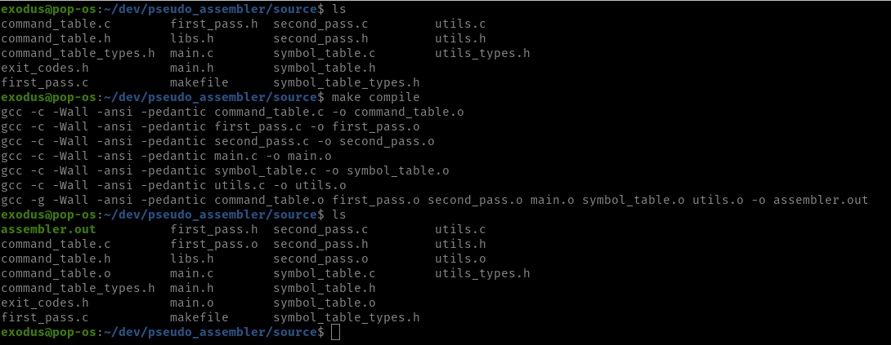
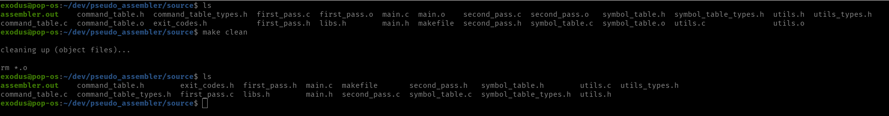
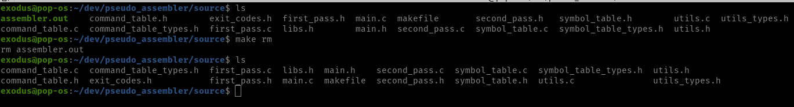
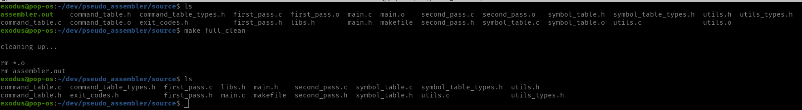

# Pseudo Assembler

[[Source Code]][src]

[src]:          ./source

A multi-pass pseudo assembler for a predefined, made-up, Assembly-type language.
Developed in C.

<h1>Compilation</h1>

This project includes a makefile for easy compilation on linux distributions:

* make:

  

With additional rules such as:

* compile:

  

* clean:

  

* rm:

  

* full_clean:

  

